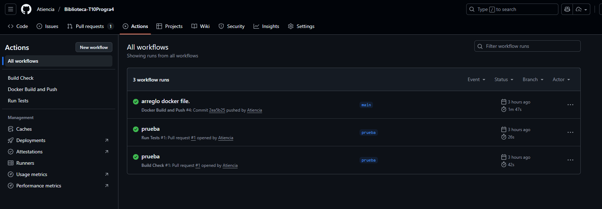
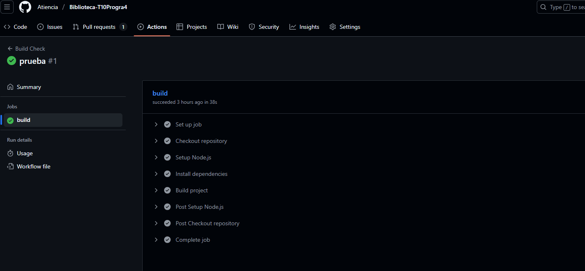
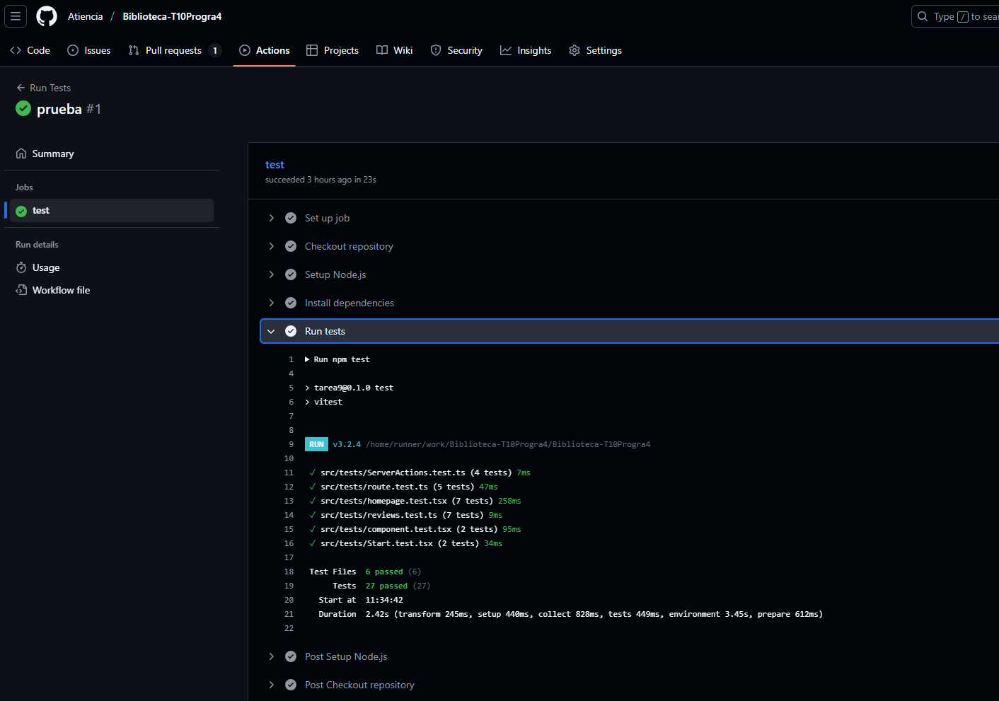
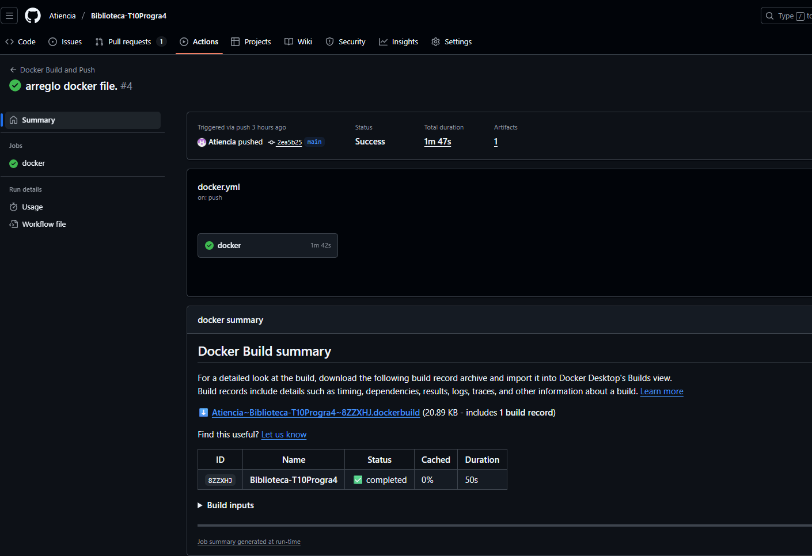
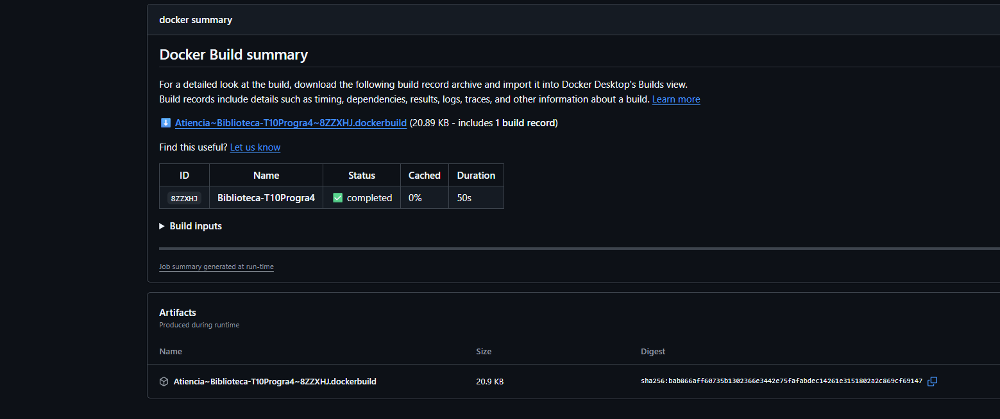

# Biblioteca
Deploy en Producción

URL pública: https://biblioteca-t10-progra4.vercel.app

# Deploy Local

Cloná el proyecto y ejecutalo localmente:

Clona el proyecto y ejecútalo localmente:

```bash
git clone https://github.com/Atiencia/Biblioteca-T10Progra4.git
cd biblioteca-t10-progra4
npm install
npm run dev
```

El proyecto incluye 3 workflows en .github/workflows/:

# 1️ Build en Pull Requests (build.yml)

Se ejecuta en cada PR hacia main.

Instala dependencias y hace npm run build.

Si falla, el PR queda bloqueado.

# 2️ Tests en Pull Requests (tests.yml)

Se ejecuta en cada PR hacia main.

Corre npm test con todos los tests unitarios.

Si algún test falla, el PR no puede mergearse.

# 3️ Docker + GHCR (docker.yml)

Se ejecuta en cada push a main.

Construye la imagen Docker optimizada con multi-stage build.

Publica automáticamente en GitHub Container Registry (GHCR) con tags:

- latest
- sha-commit

# Construir localmente:

docker build -t biblioteca-app .

Ejecutar contenedor:
```
docker run -p 3000:3000 biblioteca-app
```
Descargar imagen desde GHCR:
```
docker pull ghcr.io/usuario/biblioteca-t10-progra4:latest

docker run -p 3000:3000 ghcr.io/atiencia/biblioteca-t10-progra4:latest
```

## Pruebas

Worflows


1.  


2.  


3.  

